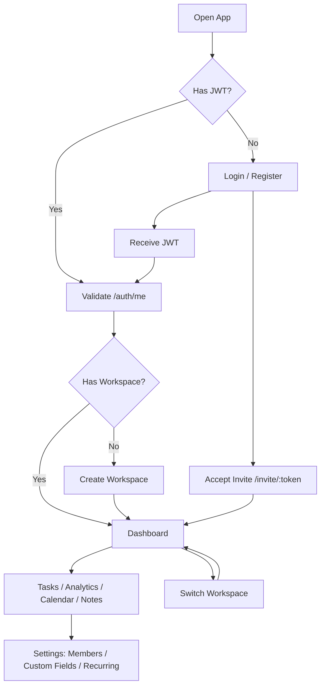
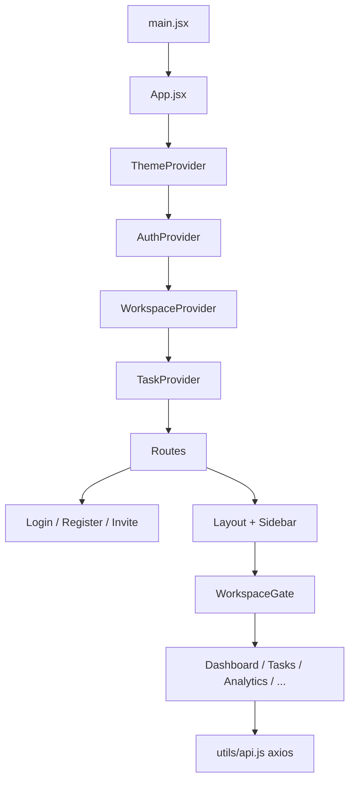
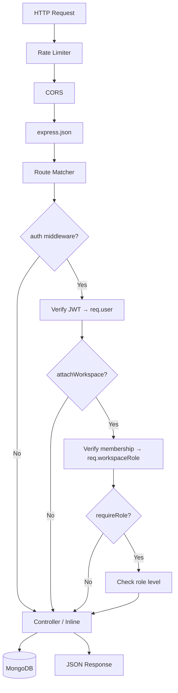
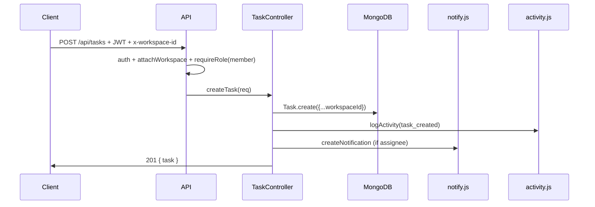
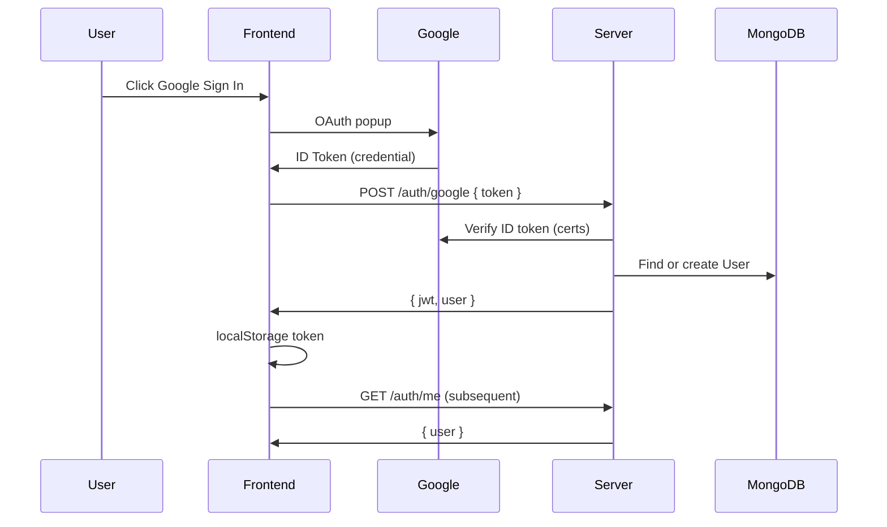

# TaskFlow — Complete Project Mastery Guide

> **Purpose:** A-to-Z knowledge transfer for developers revisiting this project.  
> **Stack:** React 19 + Vite 7 (client) · Node.js + Express 4 + MongoDB/Mongoose (server)  
> **Last analyzed:** June 2026

---

## Table of Contents

1. [Executive Summary](#1-executive-summary)
2. [Project Overview](#2-project-overview)
3. [Complete Workflow (User Journey)](#3-complete-workflow-user-journey)
4. [Feature Breakdown Table](#4-feature-breakdown-table)
5. [Architecture Analysis](#5-architecture-analysis)
6. [Visual Flow Diagrams](#6-visual-flow-diagrams)
7. [Dependency Mapping](#7-dependency-mapping)
8. [File-by-File Reference (Server)](#8-file-by-file-reference-server)
9. [File-by-File Reference (Client)](#9-file-by-file-reference-client)
10. [Function Reference (Critical Paths)](#10-function-reference-critical-paths)
11. [Hidden Logic & Business Rules](#11-hidden-logic--business-rules)
12. [Technical Review (Bugs, Gaps, Security)](#12-technical-review-bugs-gaps-security)
13. [What Breaks If You Remove X](#13-what-breaks-if-you-remove-x)
14. [Learning Roadmap](#14-learning-roadmap)
15. [Improvement Suggestions](#15-improvement-suggestions)

---

## 1. Executive Summary

**TaskFlow** is a full-stack team productivity application: task management, analytics, time tracking, workspace collaboration, invites, comments with @mentions, notifications, sticky notes, custom fields, recurring tasks, and file attachments.

**Core architectural decision:** Everything is scoped to a **Workspace**. Users authenticate globally (JWT), then every data API requires an active workspace via the `x-workspace-id` header and role-based permissions (`viewer` < `member` < `admin`).

**Maturity state:** The product has a solid foundation and many advanced features, but several "power features" are **built on the backend and partially on the frontend** without being wired into the main task UI (`TaskModal`). There are also schema mismatches and a handful of bugs worth fixing before production hardening.

**Essential files to understand first:**
- `server/server.js` — app bootstrap
- `server/middleware/auth.js` + `attachWorkspace.js` + `requireRole.js` — security spine
- `client/src/App.jsx` — routing & provider tree
- `client/src/context/*` — global state
- `client/src/utils/api.js` — all HTTP traffic

---

## 2. Project Overview

### What This Application Does

TaskFlow helps individuals and teams:
- Create, assign, filter, and track tasks with status/priority/category/due dates
- Collaborate in shared workspaces with roles
- View productivity analytics (charts, heatmaps, streaks, insights)
- Track time on tasks, manage daily recurring work, and reset daily tasks at 4 AM IST
- Communicate via comments and @mentions
- Receive in-app notifications for assignments, mentions, invites, overdue tasks
- Store sticky notes per workspace
- Define custom fields and recurring task templates (admin)

### Target Users

| User | Role | Primary use |
|------|------|-------------|
| Solo user | Admin of own workspace | Personal productivity + analytics |
| Team lead | Admin | Invite members, assign work, view team analytics |
| Team member | Member | Execute tasks, comment, update status |
| Stakeholder | Viewer (backend only; limited UI) | Read-only visibility |

### Main Business Goal

Increase team productivity through **visibility** (dashboards/analytics), **accountability** (assignments, activity feed), and **habit formation** (daily tasks, streaks, calendar).

### Real-World Use Cases

1. **Marketing launch** — Admin creates workspace, invites copywriters, assigns tasks with due dates, tracks completion on dashboard.
2. **Personal habit tracker** — Solo user uses daily tasks + calendar + streak analytics.
3. **Engineering sprint** — Team uses task statuses, comments with @mentions, custom fields for story points (if configured).
4. **Client onboarding** — Admin sends email invite links; new member accepts and lands in workspace.

---

## 3. Complete Workflow (User Journey)

### 3.1 First Open (Cold Start)

```
Browser → http://localhost:5173
  → main.jsx loads React + GoogleOAuthProvider + CSS
  → App.jsx mounts provider tree: Theme → Auth → Workspace → Task
  → AuthContext: reads localStorage taskflow_token
      → if token exists: GET /api/auth/me
      → if valid: set user; if 401: clear storage; if network error: keep cached user
  → Route "/" matches Layout → WorkspaceGate → Dashboard
  → WorkspaceContext: GET /api/workspaces/mine (if authenticated)
  → useDashboard: GET /api/dashboard (requires x-workspace-id header)
```

**If not authenticated:** No route guard redirects to login — user may see shell with failed API calls until 401 interceptor sends them to `/login`. *(Known gap)*

**If authenticated but no workspace:** `WorkspaceGate` shows "Create Workspace" card → `POST /api/workspaces` → creator becomes admin → page continues.

### 3.2 Registration Flow

```
/register → Register.jsx
  → User fills name/email/password OR clicks Google
  → POST /api/auth/register OR POST /api/auth/google
  → Server: hash password (bcrypt) OR verify Google ID token
  → Server: create User document, return JWT (7-day) + user object
  → Client: localStorage taskflow_token + taskflow_user
  → navigate('/') → WorkspaceGate (no workspace yet) → create workspace UI
```

### 3.3 Login Flow

```
/login → Login.jsx
  → useEffect: fetch /api/health (wake cold server on Render)
  → Email/password: POST /api/auth/login
  → Google: GoogleLogin widget → credential → POST /api/auth/google
  → Same token storage as register
  → navigate('/') or ?redirect= URL
```

### 3.4 Workspace Switch Flow

```
WorkspaceSwitcher → switchWorkspace(id)
  → POST /api/workspaces/:id/switch (validates membership)
  → localStorage activeWorkspace updated
  → window.location.reload()  ← full page reload, clears in-memory state
  → axios interceptor re-attaches new x-workspace-id
```

### 3.5 Task CRUD Flow

```
/tasks → TaskContext.fetchTasks() → GET /api/tasks?filters
  → Server: auth → attachWorkspace → requireRole(viewer) → taskController.getTasks
  → MongoDB: Task.find({ workspaceId })

Create: TaskModal → POST /api/tasks
  → requireRole(member)
  → taskController.createTask: validate, save, logActivity, notify assignee

Update status: TaskCard dropdown → PATCH /api/tasks/:id/status
  → updateTaskStatus: set completedAt if COMPLETED

Delete: PermissionGate → DELETE /api/tasks/:id
```

### 3.6 Invite Flow

```
Admin: Members → InviteModal → POST /api/invites { email, role }
  → Create Invite token (UUID, 7-day expiry)
  → sendInviteEmail via Nodemailer
  → createNotification for existing user if email matches

Recipient: clicks link → /invite/:token
  → GET /api/invites/:token (public preview)
  → If not logged in: redirect to login/register with redirect back
  → POST /api/invites/:token/accept
  → Create WorkspaceMember, mark invite accepted
  → window.location.href = '/'
```

### 3.7 Daily Reset (Background)

```
Cron: 4:00 AM IST (dailyReset.js)
  → Find all tasks where isDaily: true
  → Snapshot each to DailyHistory (status, wasCompleted, date)
  → Reset task status to NOT_STARTED

On server startup: checkMissedReset()
  → If last reset date < today → run reset immediately
```

### 3.8 Request/Response Lifecycle

```
Client axios request
  → Request interceptor: Authorization: Bearer <jwt>
  → Workspace interceptor: x-workspace-id: <workspaceId>
  → Vite dev proxy: /api → localhost:5000
  → Express rate limiter (10k/15min)
  → Route-specific middleware chain
  → Controller / inline handler
  → Mongoose → MongoDB Atlas
  → JSON response
  → Client: update context state OR toast error
  → 401: clear auth, redirect /login
```

---

## 4. Feature Breakdown Table

| Feature | Purpose | Key Files | Workflow | Status |
|---------|---------|-----------|----------|--------|
| **JWT Auth** | Secure sessions | `authController.js`, `AuthContext.jsx`, `api.js` | Login → token → Bearer header | ✅ Working |
| **Google OAuth** | SSO login | `main.jsx`, `authController.googleLogin` | Google widget → ID token → verify | ✅ Working (needs env + TLS fix on some networks) |
| **Workspaces** | Multi-tenant data isolation | `Workspace.js`, `WorkspaceContext.jsx`, `workspaces.js` | Create/list/switch/delete | ✅ Working |
| **RBAC** | Role permissions | `requireRole.js`, `roles.js`, `PermissionGate.jsx` | viewer/member/admin hierarchy | ✅ Backend solid; UI partial |
| **Task CRUD** | Core product | `taskController.js`, `TaskContext.jsx`, `Tasks.jsx` | List/create/edit/delete/filter | ✅ Working |
| **Task status** | Workflow states | `Task.js` enum, `TaskCard.jsx` | NOT_STARTED → IN_PROGRESS → COMPLETED | ✅ Working |
| **Assignees** | Delegation | `Task.assigneeId`, notifications | Assign on create/edit → notify | ✅ Working |
| **Comments + @mentions** | Collaboration | `comments.js`, `CommentThread.jsx`, `mentionParser.js` | Post comment → parse @handles → notify | ⚠️ Edit mentions broken (bug) |
| **Notifications** | Awareness | `notify.js`, `NotificationBell.jsx` | Poll every N seconds, mark read | ✅ Working |
| **Dashboard** | Team overview | `dashboard.js`, `useDashboard.js`, `Dashboard.jsx` | Aggregated metrics + 60s cache | ✅ Working |
| **Analytics** | Productivity insights | `analyticsController.js`, `Analytics.jsx` | Weekly/monthly/heatmap/streak | ⚠️ Some metrics broken (schema bugs) |
| **Time tracking** | Focus hours | `timeController.js`, `TaskContext` timers | Start/stop timer per task | ⚠️ API exists; **no UI in TaskCard** |
| **Daily tasks** | Habit tracking | `dailyReset.js`, `CalendarView.jsx` | isDaily flag + nightly reset | ✅ Working |
| **Calendar view** | Visual daily plan | `CalendarView.jsx`, `getDailyHistory` | Month grid + day detail | ⚠️ Minor UX bugs |
| **Notes** | Quick capture | `noteController.js`, `Notes.jsx` | CRUD + pin + colors | ✅ Working |
| **Email invites** | Onboarding | `email.js`, `invites.js`, `InviteModal.jsx` | SMTP email with token link | ✅ Working (needs SMTP env) |
| **Custom fields** | Extensible metadata | `CustomField.js`, `CustomFieldsPage.jsx` | Admin defines fields | ⚠️ **Not in TaskModal** |
| **Recurring tasks** | Automation | `recurringTasks.js`, `RecurringTasksPage.jsx` | Hourly cron spawns instances | ⚠️ **Not in TaskModal** |
| **Attachments** | File storage | `attachments.js`, `AttachmentsSection.jsx` | Local or Cloudinary upload | ⚠️ **Not in TaskModal**; Cloudinary pkgs missing |
| **Activity feed** | Audit trail | `activity.js`, `ActivityFeed.jsx` | logActivity on key actions | ✅ Working |
| **Theme** | UX preference | `ThemeContext.jsx`, `index.css` | light/dark/system via data-theme | ✅ Working |
| **Seed data** | Dev bootstrap | `seed.js` | Default admin@taskflow.com | ⚠️ Broken for workspace-required schema |

---

## 5. Architecture Analysis

### 5.1 Frontend Architecture

```
Presentation Layer (Pages + Components)
        ↓
State Layer (4 React Contexts + 5 custom hooks)
        ↓
API Layer (axios singleton in utils/api.js)
        ↓
Vite dev proxy → Express API
```

**Patterns used:**
- Context API for global state (no Redux/React Query)
- Container/presentational split (pages compose components)
- Permission gating via `PermissionGate` + `usePermission`
- Polling for notifications (30s), comments (5s), dashboard (60s)
- Full page reload on workspace switch (simple but heavy)

### 5.2 Backend Architecture

```
Express HTTP Layer (routes)
        ↓
Middleware Pipeline (auth → attachWorkspace → requireRole)
        ↓
Controllers / Inline Handlers
        ↓
Services (email, notify, activity, dailyReset)
        ↓
Mongoose Models → MongoDB Atlas
        ↓
Background Jobs (node-cron: daily reset, overdue, recurring)
```

**Patterns used:**
- MVC-ish (routes → controllers → models)
- Some business logic inline in route files (workspaces, invites, dashboard)
- Service modules for cross-cutting concerns
- No repository layer; controllers query models directly

### 5.3 Database Architecture

**Database:** MongoDB (Atlas in production, connection string in `MONGODB_URI`)

**13 collections (via Mongoose models):**

```
User ──┬── Workspace (ownerId)
       ├── WorkspaceMember (userId + workspaceId + role)
       ├── Task (userId creator, assigneeId, workspaceId)
       ├── Note, Comment, Notification, Activity
       ├── TimeEntry, Attachment, CustomField, Invite, DailyHistory
```

**Key indexes/constraints:**
- User.email: unique
- User.googleId: sparse unique
- WorkspaceMember: unique compound (workspaceId, userId)
- Activity: TTL 30 days on createdAt

### 5.4 Authentication Architecture

```
┌─────────────┐     JWT (7d)      ┌─────────────┐
│   Client    │ ◄──────────────► │   Server    │
│ localStorage│   Bearer header   │  auth.js    │
└─────────────┘                   └─────────────┘
       │                                 │
       │ Google ID Token                 │ google-auth-library
       └────────────────────────────────►│ verify audience
```

- Passwords: bcrypt, salt 12, `select: false`
- Google: verifies ID token audience matches `GOOGLE_CLIENT_ID`
- No refresh tokens; re-login after 7 days

### 5.5 API Architecture

- REST JSON under `/api/*`
- Workspace context via header `x-workspace-id` (not URL for most routes)
- Nested resources: `/api/tasks/:taskId/comments`, `/api/tasks/:taskId/attachments`
- Health: `GET /api/health`
- Static files: `GET /uploads/*` (local storage mode)

### 5.6 State Management Architecture

| State | Owner | Persisted |
|-------|-------|-----------|
| Auth user + token | AuthContext | localStorage |
| Active workspace | WorkspaceContext | localStorage |
| Tasks list | TaskContext | Memory only |
| Theme | ThemeContext | localStorage |
| Page-local (notes, analytics) | useState in pages | No |

### 5.7 Deployment Architecture

| Part | Dev | Production (inferred) |
|------|-----|----------------------|
| Client | Vite :5173 | Vercel (`vercel.json` COOP header) |
| Server | Express :5000 | Render or similar (health wake-up in Login) |
| DB | MongoDB Atlas | MongoDB Atlas |
| Files | `server/uploads/` local | Cloudinary (not fully wired) |
| Env | `server/.env`, `client/.env` | Separate secrets per service |

---

## 6. Visual Flow Diagrams

### 6.1 User Flow Diagram



### 6.2 Frontend Flow Diagram



### 6.3 Backend Flow Diagram



### 6.4 Database Flow (Task Create)



### 6.5 Authentication Flow Diagram



### 6.6 Request/Response Lifecycle

```
1. User action (click, submit)
2. Component calls context/hook/API
3. axios request interceptor adds headers
4. HTTP to /api/... (proxied in dev)
5. Express middleware chain
6. Business logic + DB query
7. JSON response
8. React setState / context update
9. UI re-render
10. Optional: toast, navigate, poll refresh
```

---

## 7. Dependency Mapping

### 7.1 Server Import Chain (Simplified)

```
server.js
├── config/db.js
├── config/seed.js → User, Task (⚠️ schema mismatch)
├── services/dailyReset.js → Task, DailyHistory
├── jobs/overdueChecker.js → Task, notify
├── jobs/recurringTasks.js → Task, notify, activity
├── routes/*
│   ├── controllers/*
│   ├── middleware/auth → User, jsonwebtoken
│   ├── middleware/attachWorkspace → WorkspaceMember
│   └── middleware/requireRole → utils/roles
└── services/email, notify, activity
```

### 7.2 Client Component Hierarchy

See Section 9 and agent inventory — key chain:

```
App → Layout → Outlet → Page → Feature Components → API
```

### 7.3 API Dependency Chain

```
All workspace data APIs depend on:
  1. Valid JWT (auth)
  2. Valid x-workspace-id (attachWorkspace)
  3. Sufficient role (requireRole) — except auth, public invite preview

Notifications API depends only on JWT (user-scoped, not workspace-scoped)
```

### 7.4 Database Dependency Chain

```
Workspace is root tenant entity
  → Tasks, Notes, Comments, Activities, CustomFields, Invites, Attachments
  → All reference workspaceId

User is global identity
  → WorkspaceMember links User ↔ Workspace
  → Task.userId (creator), Task.assigneeId
```

---

## 8. File-by-File Reference (Server)

### `server/server.js` — **ESSENTIAL**
| Aspect | Detail |
|--------|--------|
| **Why exists** | Application entry point |
| **Problem solved** | Bootstraps Express, wires all routes and jobs |
| **When executed** | `npm start` / `npm run dev` |
| **Used by** | Node process directly |
| **Depends on** | All routes, config, jobs, middleware |
| **Input/Output** | HTTP in → HTTP out |
| **Contribution** | Central orchestrator |

**Startup sequence:** dotenv → optional TLS bypass → connectDB (async) → seed → crons → listen on PORT.

---

### `server/config/db.js` — **ESSENTIAL**
- Connects Mongoose to `MONGODB_URI` with 3 retries, 5s delay
- Exits process on total failure
- **Called from:** `server.js` only

---

### `server/config/seed.js` — **OPTIONAL (dev)**
- Creates `admin@taskflow.com` / `admin123` + 15 sample tasks if no users
- **Bug:** Tasks require `workspaceId` now — seed likely fails on fresh DB
- **Risk:** Logs plaintext credentials to console

---

### Middleware

#### `middleware/auth.js` — **ESSENTIAL**
- Extracts `Bearer` token, verifies JWT with `JWT_SECRET`, loads `User`, sets `req.user` / `req.userId`
- Returns 401 on failure
- **Used by:** All protected routes (via mount or router)

#### `middleware/attachWorkspace.js` — **ESSENTIAL**
- Reads workspace ID from `x-workspace-id` header, `body.workspaceId`, or `query.workspaceId`
- Verifies `WorkspaceMember` exists
- Sets `req.workspaceId`, `req.workspaceRole`
- **Gap:** Does not read `:id` from URL path (custom-fields route)

#### `middleware/requireRole.js` — **ESSENTIAL**
- Factory: `requireRole('member')` returns middleware
- Uses `hasPermission(userRole, requiredRole)` from `utils/roles.js`
- **Role hierarchy:** viewer=1, member=2, admin=3

---

### Models (Summary)

| Model | Essential | Key Fields | Relationships |
|-------|-----------|------------|-----------------|
| `User.js` | ✅ | name, email, password?, googleId?, avatar | Referenced everywhere |
| `Workspace.js` | ✅ | name, description, ownerId | Parent tenant |
| `WorkspaceMember.js` | ✅ | workspaceId, userId, role | Join table |
| `Task.js` | ✅ | title, status, priority, workspaceId, assigneeId, isDaily, recurrence, customFields | Core entity |
| `Invite.js` | ✅ | token, email, role, expiresAt, status | Onboarding |
| `Note.js` | ✅ | title, content, color, isPinned, workspaceId | Sticky notes |
| `Comment.js` | ✅ | taskId, text, mentions[], deleted (soft) | Collaboration |
| `Notification.js` | ✅ | userId, type, text, read, link | Alerts |
| `Activity.js` | ✅ | workspaceId, type, text, TTL 30d | Audit feed |
| `TimeEntry.js` | ✅ | taskId, userId, start/end, duration, isRunning | Time tracking |
| `DailyHistory.js` | ✅ | taskId, status, wasCompleted, date | **Missing workspaceId (bug)** |
| `CustomField.js` | ✅ | workspaceId, name, type, options | Extensibility |
| `Attachment.js` | ✅ | taskId, filename, url, mimeType, size | Files |

---

### Controllers

#### `controllers/authController.js`
| Function | Purpose | Called From |
|----------|---------|-------------|
| `register` | Create user, return JWT | POST /auth/register |
| `login` | Validate password, return JWT | POST /auth/login |
| `googleLogin` | Verify Google token, find/create user | POST /auth/google |
| `getMe` | Return current user | GET /auth/me |

#### `controllers/taskController.js`
| Function | Purpose |
|----------|---------|
| `getTasks` | Filtered paginated list by workspace |
| `getTodayTasks` | Tasks due today or daily |
| `createTask` | Create with validation, activity, notify |
| `updateTask` | Full update (PUT) |
| `updateTaskStatus` | Status-only patch, sets completedAt |
| `deleteTask` | Remove task |
| `getCategories` | Distinct categories in workspace |
| `getDailyHistory` | Historical daily snapshots (**workspace filter broken**) |

#### `controllers/timeController.js`
| Function | Purpose |
|----------|---------|
| `startTimer` | Create running TimeEntry (**creator-only, not assignee**) |
| `stopTimer` | End timer, compute duration |
| `getTimeEntries` | List entries for task |
| `getRunningTimers` | User's active timers |
| `getWeeklyFocusHours` | Aggregate duration for analytics |

#### `controllers/analyticsController.js`
| Function | Purpose |
|----------|---------|
| `getDashboardStats` | Counts by status, completion % |
| `getWeeklyAnalytics` | Bar chart data + focus hours (**broken workspace filter on TimeEntry**) |
| `getMonthlyAnalytics` | Monthly aggregates |
| `getHeatmapData` | GitHub-style contribution grid |
| `getStreak` | Consecutive days with completions |
| `getInsights` | Rule-based "smart" tips |

#### `controllers/noteController.js`
- Standard CRUD + `togglePin` for notes

---

### Routes (Mount Points)

| File | Base Path | Global Middleware |
|------|-----------|-------------------|
| `auth.js` | `/api/auth` | None (except /me) |
| `workspaces.js` | `/api/workspaces` | auth per route |
| `invites.js` | `/api/invites` | Mixed |
| `tasks.js` | `/api/tasks` | auth + attachWorkspace |
| `comments.js` | `/api/tasks/:taskId/comments` | auth + attachWorkspace |
| `analytics.js` | `/api/analytics` | auth + attachWorkspace |
| `notes.js` | `/api/notes` | auth + attachWorkspace |
| `notifications.js` | `/api/notifications` | auth on router |
| `dashboard.js` | `/api/dashboard` | auth + attachWorkspace + viewer |
| `customFields.js` | `/api/workspaces/:id/custom-fields` | auth + attachWorkspace |
| `attachments.js` | `/api/tasks/:taskId/attachments` | auth + attachWorkspace |

---

### Services

| File | Exports | When Runs |
|------|---------|-----------|
| `email.js` | `sendInviteEmail` | On invite creation |
| `notify.js` | `createNotification`, `createBulkNotifications` | On assign, mention, invite, overdue |
| `activity.js` | `logActivity` | On task/comment/invite actions |
| `dailyReset.js` | `initDailyResetCron`, `checkMissedReset` | 4 AM IST + startup |

---

### Jobs

| File | Schedule | Purpose |
|------|----------|---------|
| `overdueChecker.js` | Daily 8 AM | Notify assignees (**bug: checks status 'done' not 'COMPLETED'**) |
| `recurringTasks.js` | Hourly | Clone recurring task instances |

---

### Utils

| File | Purpose |
|------|---------|
| `roles.js` | `ROLES`, `hasPermission()` |
| `mentionParser.js` | `extractMentionHandles()`, `resolveMentions()` for @user |

---

## 9. File-by-File Reference (Client)

### Entry & Config

| File | Essential | Purpose |
|------|-----------|---------|
| `main.jsx` | ✅ | ReactDOM render, GoogleOAuthProvider, CSS imports |
| `App.jsx` | ✅ | Router, providers, WorkspaceGate, routes |
| `vite.config.js` | ✅ | Dev server, /api proxy, COOP header |
| `index.html` | ✅ | HTML shell, Inter font |
| `vercel.json` | Prod | COOP header for OAuth |
| `App.css` | ❌ UNUSED | Empty stub |

### Contexts — **ALL ESSENTIAL**

| File | State | Key Actions |
|------|-------|-------------|
| `AuthContext.jsx` | user, loading | login, register, googleLogin, logout |
| `WorkspaceContext.jsx` | workspaces, activeWorkspace | switchWorkspace, createWorkspace, axios header interceptor |
| `TaskContext.jsx` | tasks, pagination, categories | CRUD, timers, fetchCategories |
| `ThemeContext.jsx` | preference, resolvedTheme | setTheme, toggleTheme |

### Pages

| Page | Route | API Calls | Notes |
|------|-------|-----------|-------|
| `Login.jsx` | /login | /auth/login, /auth/google | Health wake-up |
| `Register.jsx` | /register | /auth/register, /auth/google | Same layout as login |
| `Dashboard.jsx` | / | useDashboard hook | Metrics, charts, activity |
| `Tasks.jsx` | /tasks | TaskContext | Main task table |
| `Analytics.jsx` | /analytics | /analytics/* | Charts + heatmap |
| `CalendarView.jsx` | /calendar | /tasks, /daily-history | Daily task calendar |
| `Notes.jsx` | /notes | /notes CRUD | Inline NoteCard/Modal |
| `Members.jsx` | /members | /workspaces/:id/members, invites | Team admin |
| `CustomFieldsPage.jsx` | /settings/custom-fields | custom-fields API | Admin definitions |
| `RecurringTasksPage.jsx` | /settings/recurring-tasks | tasks with recurrence | List/disable |
| `AcceptInvite.jsx` | /invite/:token | invite preview/accept | Onboarding |

### Orphaned Components (Built but NOT wired)

| Component | Status |
|-----------|--------|
| `CustomFieldsSection.jsx` | ❌ Not imported in TaskModal |
| `RecurrenceSettings.jsx` | ❌ Not imported in TaskModal |
| `AttachmentsSection.jsx` | ❌ Not imported in TaskModal |

### Hooks

| Hook | Polls | Purpose |
|------|-------|---------|
| `useDashboard.js` | 60s | Dashboard data |
| `useNotifications.js` | 30s | Notifications + unread count |
| `useComments.js` | 5s | Task comment thread |
| `useInvites.js` | On demand | Pending invites |
| `usePermission.js` | — | `can(action)` from role |

### Utils

| File | Exports |
|------|---------|
| `api.js` | axios instance + 401 interceptor |
| `helpers.js` | formatDate, formatTime, isOverdue, CATEGORIES, PRIORITIES, STATUSES |
| `roles.js` | ROLES, ACTION_ROLES, hasPermission |

### Styling

| File | Lines | Role |
|------|-------|------|
| `index.css` | ~2900 | Design system, CSS variables, most UI |
| `dashboard.css` | — | Dashboard-specific |
| `powerFeatures.css` | — | Custom fields, recurrence, attachments |

**Approach:** CSS custom properties (`--bg-primary`, `--accent`, etc.) + `[data-theme="light"]` overrides. No Tailwind/CSS Modules.

---

## 10. Function Reference (Critical Paths)

### Auth: `googleLogin` (server)

```
Parameters: req.body.token (Google ID token JWT)
Returns: { token: appJWT, user: { id, name, email, avatar } }
Logic:
  1. client.verifyIdToken({ idToken, audience: GOOGLE_CLIENT_ID })
  2. Extract sub, email, name, picture
  3. Find user by email OR create with googleId
  4. Link googleId to existing email user if needed
  5. generateToken(user._id) — 7 day JWT
Called from: POST /api/auth/google
Real-world: User clicks "Sign in with Google" on login page
```

### Workspace: `attachWorkspace` middleware

```
Parameters: req (reads x-workspace-id header)
Returns: next() or 400/403
Logic:
  1. Parse workspace ID from header/body/query
  2. WorkspaceMember.findOne({ workspaceId, userId })
  3. Attach workspaceId + role to req
Called from: Every workspace-scoped route
Why created: Multi-tenant isolation without subdomain routing
```

### Task: `createTask`

```
Parameters: req.body { title, description, status, priority, category, dueDate, assigneeId, isDaily, ... }
Returns: 201 { task }
Logic:
  1. Validate required fields
  2. Task.create({ ...req.body, userId, workspaceId })
  3. logActivity('task_created')
  4. If assigneeId !== creator: createNotification('task_assigned')
Called from: POST /api/tasks, TaskModal onSave
```

### Daily Reset: `runDailyReset`

```
Parameters: none (reads DB)
Returns: void
Logic:
  1. Find tasks where isDaily: true
  2. For each: save DailyHistory snapshot
  3. Set status = NOT_STARTED
When: Cron 4 AM IST + missed reset on startup
Real-world: "Brush teeth" daily task resets each morning
```

### Client: `googleLogin` (AuthContext)

```
Parameters: token (Google credential string)
Returns: res.data
Logic:
  1. API.post('/auth/google', { token })
  2. Save token + user to localStorage
  3. setUser
Called from: Login.jsx, Register.jsx handleGoogleSuccess
```

---

## 11. Hidden Logic & Business Rules

### Validation Rules

| Entity | Rule |
|--------|------|
| User.name | 2–50 chars, required |
| User.email | Valid email format, unique, lowercase |
| User.password | Min 6 chars, required unless googleId set |
| Task.title | Required |
| Task.workspaceId | Required (every task belongs to workspace) |
| Task.status | Enum: NOT_STARTED, IN_PROGRESS, COMPLETED |
| Comment.text | Max length in schema |
| Attachment | MIME whitelist, 10MB max, 20 files per task |
| Invite | 7-day expiry, email must match on accept |

### Access Control Rules

| Action | Minimum Role |
|--------|--------------|
| View tasks, analytics, notes | viewer |
| Create/edit/delete tasks | member |
| Invite members, manage roles | admin |
| Delete workspace | owner only (ownerId check) |
| Custom field definitions | admin |
| Custom field values on tasks | member |

**Frontend mirrors backend** via `ACTION_ROLES` in `client/src/utils/roles.js` and `PermissionGate`.

### Security Mechanisms

- JWT Bearer authentication
- bcrypt password hashing (12 rounds)
- Rate limiting (very permissive: 10k/15min)
- CORS with `CLIENT_URL` (defaults to `*`)
- Invite tokens (UUID, time-limited)
- File upload type restrictions
- Password field `select: false`

### Edge Cases

1. **Workspace switch** → full page reload (clears stale task state)
2. **Auth /me network failure** → keeps cached user (offline-tolerant)
3. **401 only** triggers logout (5xx does not)
4. **Missed daily reset** → runs on server startup
5. **Google user without workspace** → blocked by WorkspaceGate
6. **Member cannot delete others' tasks** — documented in ROLE_WORKFLOWS.md but **not enforced in backend** (any member can delete)

### Cron Schedule Summary

| Job | Time | Timezone |
|-----|------|----------|
| Daily task reset | 4:00 AM | IST |
| Overdue notifications | 8:00 AM | Server local |
| Recurring tasks | Every hour | Server local |

---

## 12. Technical Review (Bugs, Gaps, Security)

### Critical Bugs

| # | Issue | Impact |
|---|-------|--------|
| 1 | `overdueChecker` uses `status != 'done'` but enum is `COMPLETED` | Wrong tasks flagged overdue |
| 2 | `DailyHistory` missing `workspaceId` but queried by it | Daily history / analytics empty |
| 3 | `TimeEntry` missing `workspaceId` but aggregated by it | Focus hours always 0 |
| 4 | `createBulkNotifications` omits required `text` field | @mention bulk notify fails |
| 5 | Comment PATCH uses undefined `taskId` variable | Edit mention notifications broken |
| 6 | `PATCH /api/tasks/:id` no workspaceId in query | Cross-workspace IDOR risk |
| 7 | `seed.js` creates tasks without workspaceId | Fresh DB seed fails |

### Incomplete Features

- Custom fields, recurrence, attachments UI not in TaskModal
- Timer API exists, no timer UI in TaskCard
- Cloudinary packages not in package.json
- No auth route guard on frontend
- URL query deep links (`?action=create`) ignored in Tasks.jsx
- No WebSocket; comments use 5s polling
- `viewer` role exists in backend but limited UI support

### Security Vulnerabilities

| Risk | Severity | Detail |
|------|----------|--------|
| CORS `*` default | Medium | Any origin can call API |
| Rate limit 10k/15min | Low | Effectively disabled |
| Seed credentials in logs | High (prod) | admin@taskflow.com / admin123 |
| ALLOW_INSECURE_TLS | Medium (dev) | Disables cert verification |
| Email TLS rejectUnauthorized: false | Medium | SMTP MITM possible |
| No helmet.js | Low | Missing security headers |
| Workspace delete no cascade | Medium | Orphan data |
| Notes: any member can edit/delete any note | Low | No author check |

### Performance Bottlenecks

- Full page reload on workspace switch
- Polling (notifications, comments, dashboard) instead of WebSockets
- Dashboard in-memory cache per process (invalid in multi-instance)
- `index.css` ~2900 lines loaded entirely
- No DB pagination UI for tasks (backend supports it)

### Dead / Unused Code

- `client/src/App.css`
- `jwt-decode` package (never imported)
- Unused imports in TaskCard, Tasks, CalendarView
- `customFields.js` duplicate route path
- `attachWorkspace` unused Workspace import
- Timer icons imported in TaskCard but no UI

---

## 13. What Breaks If You Remove X

| File Removed | What Breaks |
|--------------|-------------|
| `server/server.js` | Entire backend |
| `middleware/auth.js` | All authenticated APIs |
| `middleware/attachWorkspace.js` | All workspace data APIs |
| `WorkspaceContext.jsx` | No workspace header → all task APIs 400 |
| `AuthContext.jsx` | No login state, no token |
| `utils/api.js` | No HTTP client anywhere |
| `TaskContext.jsx` | Tasks page non-functional |
| `dailyReset.js` | Daily tasks never reset |
| `services/notify.js` | No notifications |
| `services/email.js` | Invites created but no email sent |
| `TaskModal.jsx` | Cannot create/edit tasks |
| `vite.config.js` proxy | Dev API calls fail (CORS) |

---

## 14. Learning Roadmap

### Day 1 — Skeleton (2–3 hours)
1. Read this guide's Executive Summary + Architecture sections
2. Run `npm run dev` in `server/` and `client/`
3. Trace one login request in browser DevTools → Network tab
4. Read `App.jsx`, `AuthContext.jsx`, `api.js`

### Day 2 — Multi-tenancy (3–4 hours)
1. Read `attachWorkspace.js`, `requireRole.js`, `roles.js` (server + client)
2. Create a workspace, invite a test user
3. Read `WorkspaceContext.jsx`, `WorkspaceGate`
4. Read `ROLE_WORKFLOWS.md`

### Day 3 — Core domain (4–5 hours)
1. Read `Task.js` model + `taskController.js`
2. Read `Tasks.jsx`, `TaskCard.jsx`, `TaskModal.jsx`, `TaskContext.jsx`
3. Create/edit/delete a task; watch MongoDB document
4. Trace comment flow: `CommentThread` → `useComments` → `comments.js`

### Day 4 — Analytics & background jobs (3–4 hours)
1. Read `analyticsController.js`, `Dashboard.jsx`, `useDashboard.js`
2. Read `dailyReset.js`, `overdueChecker.js`, `recurringTasks.js`
3. Understand `DailyHistory` and calendar view

### Day 5 — Power features & hardening (4–5 hours)
1. Read orphaned components: `CustomFieldsSection`, `RecurrenceSettings`, `AttachmentsSection`
2. Review Section 12 bugs — pick one to fix as exercise
3. Read `invites.js`, `email.js`, `AcceptInvite.jsx`
4. Plan wiring TaskModal to power features

### Interview Prep Checklist
- [ ] Explain workspace + RBAC model in 2 minutes
- [ ] Draw auth flow from login to API call
- [ ] List 3 bugs you'd fix first and why
- [ ] Explain daily reset cron and why DailyHistory exists
- [ ] Describe what's missing for production readiness

---

## 15. Improvement Suggestions

### P0 — Fix Before Production
1. Add `workspaceId` to `DailyHistory` and `TimeEntry` schemas
2. Fix overdue checker status enum
3. Fix `createBulkNotifications` to include `text`
4. Fix comment edit `taskId` bug
5. Add workspace scoping to `PATCH /api/tasks/:id`
6. Add frontend auth route guard
7. Wire `CustomFieldsSection`, `RecurrenceSettings`, `AttachmentsSection` into `TaskModal`
8. Remove or fix `seed.js` for workspace model
9. Document all env vars in `.env.example` (including `VITE_*`)

### P1 — Quality
1. Replace polling with WebSockets or SSE for notifications/comments
2. Add React Query for cache + invalidation
3. Remove `window.location.reload()` on workspace switch
4. Add proper `ProtectedRoute` component
5. Implement task timer UI
6. Add helmet, stricter rate limits, auth-specific rate limiting
7. Cascade delete or soft-delete workspace data

### P2 — Product
1. Viewer role UI support
2. Task templates / bulk create
3. Email notification preferences
4. Export analytics PDF/CSV
5. Mobile responsive polish
6. Onboarding wizard (workspace creation after register)

---

## Appendix A — Environment Variables (Complete)

### Server (`server/.env`)

| Variable | Required | Purpose |
|----------|----------|---------|
| `MONGODB_URI` | ✅ | MongoDB connection string |
| `JWT_SECRET` | ✅ | JWT signing key |
| `GOOGLE_CLIENT_ID` | For Google login | OAuth audience verification |
| `PORT` | No (5000) | Server port |
| `CLIENT_URL` | No (`*`) | CORS origin |
| `EMAIL_HOST/PORT/USER/PASS` | For invites | SMTP |
| `FRONTEND_URL` | For invites | Link base in emails |
| `STORAGE_STRATEGY` | No (`local`) | `local` or `cloudinary` |
| `CLOUDINARY_*` | If cloudinary | Cloud storage |
| `ALLOW_INSECURE_TLS` | Dev only | Google OAuth SSL workaround |
| `NODE_ENV` | No | production vs development |

### Client (`client/.env`)

| Variable | Required | Purpose |
|----------|----------|---------|
| `VITE_GOOGLE_CLIENT_ID` | For Google login | Must match server |
| `VITE_API_URL` | No (`/api`) | API base URL (production) |

---

## Appendix B — Complete API Endpoint List

See server inventory in Section 8 — ~60 endpoints across auth, workspaces, tasks, comments, analytics, notes, notifications, dashboard, custom fields, attachments, invites.

---

## Appendix C — localStorage Keys

| Key | Set By | Purpose |
|-----|--------|---------|
| `taskflow_token` | AuthContext | JWT |
| `taskflow_user` | AuthContext | Cached user object |
| `activeWorkspace` | WorkspaceContext | Current workspace JSON |
| `taskflow_theme` | ThemeContext | light/dark/system |

---

*End of TaskFlow Project Mastery Guide. For role-specific workflows, also read `ROLE_WORKFLOWS.md`.*
